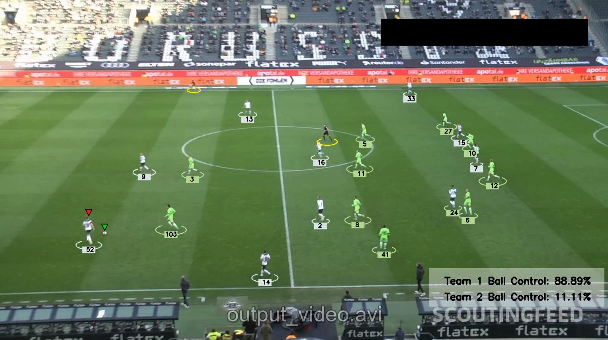

# Football Tracking Analytics System

## Project Overview
A computer vision pipeline that automatically tracks players, identifies teams, and analyzes ball possession in football (soccer) match videos. 

## Key Features
- **Real-time object detection** of players, referees, and ball using YOLOv8
- **Team classification** based on jersey color analysis with K-means clustering
- **Ball possession tracking** with distance-based assignment logic
- **Advanced visualizations** including:
  - Player tracking with team-specific annotations
  - Ball possession indicators
  - Real-time control percentage statistics

## Technical Implementation
### Core Components
1. **Detection & Tracking**
   - YOLOv8 for player/ball detection
   - ByteTrack for maintaining player identities across frames
   - Bounding box interpolation for smooth trajectories

2. **Team Identification**
   - K-means clustering (scikit-learn) on jersey colors
   - Upper-body focused analysis to improve accuracy
   - Caching system to maintain consistent team assignments

3. **Ball Possession Logic**
   - Euclidean distance calculation to nearest player
   - Configurable threshold for possession assignment
   - Temporal smoothing to reduce flickering

## Output Examples

